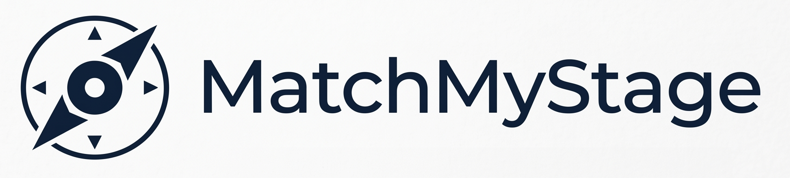
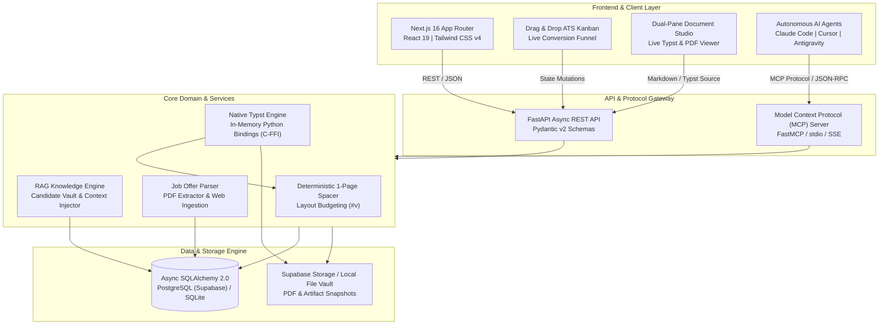

<p align="center">
  
</p>

<p align="center">
  <strong>An Agent-Native Career Co-Pilot & ATS Application Pipeline</strong>
</p>

<p align="center">
  <a href="https://matchmystage.com"></a>
  <a href="https://python.org"></a>
  <a href="https://fastapi.tiangolo.com"></a>
  <a href="https://nextjs.org"></a>
  <a href="https://react.dev"></a>
  <a href="https://typst.app"></a>
  <a href="https://modelcontextprotocol.io"></a>
  <a href="https://tailwindcss.com"></a>
  <a href="LICENSE"></a>
</p>

---

> [!NOTE]
> **Showcase & Technical Specification Repository**
> 
> MatchMyStage is a proprietary SaaS application. This repository serves as its public engineering showcase, architectural specification, Model Context Protocol (MCP) tool documentation, and design breakdown.
>
> Live Platform: [https://matchmystage.com](https://matchmystage.com)

---

## Executive Summary

Job candidates face two extremes in their application workflows:
- Uncalibrated word processors and rigid ATS form builders that spill onto a second page and format inconsistently.
- Generic AI resume builders that hallucinate metrics, invent unverified qualifications, and generate slow, bloated LaTeX files.

**MatchMyStage** solves this problem through an end-to-end, agent-native career co-pilot and ATS pipeline:

1. **Context-Action-Result (CAR) Optimization**: Resumes and cover letters are tailored to target job specifications while remaining strictly grounded in verified candidate knowledge to eliminate AI hallucinations.
2. **Sub-Second Typst Compilation (< 50ms)**: Replaces legacy multi-second LaTeX pipelines with an in-memory Python Typst compiler executing via Rust C-FFI, generating strict single-page, ATS-optimized vector PDFs.
3. **Agent-Native Architecture (MCP)**: Implements a production-grade Model Context Protocol (MCP) server, enabling external AI agents (Claude Code, Cursor, Antigravity) to query candidate profiles, analyze job descriptions, and compile documents directly.

Engineered and architected by **Louis Le Forestier**, MatchMyStage demonstrates production full-stack engineering, distributed agentic protocols, and type-safe systems design.

---

## Table of Contents

- [System Architecture](#system-architecture)
- [Key Engineering Pillars](#key-engineering-pillars)
- [Feature Showcase](#feature-showcase)
- [Technical Stack](#technical-stack)
- [Model Context Protocol (MCP) Suite](#model-context-protocol-mcp-suite)
- [Document Studio & Typst Compilation Engine](#document-studio--typst-compilation-engine)
- [About the Creator](#about-the-creator)
- [License](#license)

---

## System Architecture

MatchMyStage is built on a decoupled, event-driven architecture combining an asynchronous Python backend, a high-performance Next.js 16 frontend, an in-memory Typst compiler, and a Model Context Protocol (MCP) bridge.



---

## Key Engineering Pillars

### 1. In-Memory Typst Compilation (< 50ms)
Traditional CV generation tools rely on heavy TeX Live environments requiring multi-gigabyte container images and 3 to 8 seconds of latency per render. MatchMyStage embeds `typst-py` via Rust C-FFI:
- Eliminates command-line subprocess overhead.
- Compiles in-memory document buffers directly into vector PDFs.
- Generates ATS-readable PDFs with selectable text, embedded fonts, and sub-50ms execution times.

### 2. Deterministic 1-Page Fit Algorithm
Recruiters routinely discard junior and mid-level resumes that exceed a single page. MatchMyStage solves this through an automated vertical spacing algorithm:
- Injects parametric Typst vertical spacing macros (`#v(Xpt)`).
- Dynamically balances section margins, entry spacing, and header heights.
- Enforces strict 1-page constraints with zero overflow.

### 3. Hallucination-Free RAG Knowledge Store
Resume builders often invent credentials or experience metrics. MatchMyStage enforces a Grounded Retrieval-Augmented Generation (RAG) architecture:
- Candidate profiles are structured into granular records (Experiences, Educations, Categorized Skills, Projects).
- Additional documents (past Markdown CVs, project retrospectives, external URLs) are parsed and indexed in a candidate vault.
- Prompts injected into AI tailoring agents are strictly constrained to candidate source records.

### 4. Agentic First-Class Citizen (MCP)
MatchMyStage implements the Model Context Protocol (MCP) standard:
- Exposes over 15 granular tools across Candidate Profile, Knowledge Management, Application Tracking, and Typst Compilation.
- External agents can read job posts, cross-reference experience, draft tailored Markdown, adjust vertical spacing, and output compiled PDFs without human intervention.

---

## Feature Showcase

| Module | Technical Capabilities |
| :--- | :--- |
| **Interactive Document Studio** | Dual-pane split editor with syntax highlighting, debounced live PDF preview, modular templates (`cv_modern.typ`, `cv_minimal.typ`, `cv_tech.typ`, `cover_letter.typ`), snapshot history, and instant rollback. |
| **ATS Application Tracker** | Kanban workflow (`Wishlist`, `Applied`, `Follow-Up`, `Interview`, `Offer`, `Rejected`), table view, conversion rate funnel analytics, and company metadata enrichment. |
| **Candidate Profile Hub** | Master record of experiences, education, categorized technical skills, portfolio links, and avatar image processing. |
| **Knowledge Base (RAG)** | Local PDF parsing, text extraction, URL scraping, and Markdown ingestion to fuel contextual resume tailoring. |
| **Multi-Language Architecture** | Native internationalization framework supporting English, French, Spanish, and German document generation and interface modes. |
| **Local-First & Cloud Hybrid** | Works completely offline with zero-config SQLite, with optional seamless synchronization to Supabase PostgreSQL and Storage. |

---

## Technical Stack

### Backend Architecture
- **Language**: Python 3.11+
- **Framework**: FastAPI (Async, high throughput, OpenAPI auto-documentation)
- **ORM & Database**: Async SQLAlchemy 2.0 with `asyncpg` (PostgreSQL / Supabase) and `aiosqlite` (local)
- **Data Validation**: Pydantic v2
- **Document Engine**: Native Python `typst` bindings (Rust-backed C-FFI)
- **Protocol**: Model Context Protocol (`mcp` / `fastmcp`)
- **Extraction & Utilities**: `pypdf`, `beautifulsoup4`, `httpx`, `jinja2`

### Frontend Architecture
- **Framework**: Next.js 16.3 (React 19, App Router)
- **Language**: TypeScript 5 (Strict Mode)
- **Styling**: Tailwind CSS v4, Lucide Icons, CVA (`class-variance-authority`)
- **Components**: Headless UI architecture, Radix UI primitives, responsive drag-and-drop
- **Geo-Mapping**: MapLibre GL for internship discovery mapping
- **Auth & Cloud**: Supabase SSR (`@supabase/ssr`, `@supabase/supabase-js`)

---

## Model Context Protocol (MCP) Suite

MatchMyStage exposes a comprehensive toolset for autonomous agents:

```
+---------------------------------------------------------------------------------------+
| MATCHMYSTAGE MCP TOOLSET                                                             |
+---------------------------------------------------------------------------------------+
| CATEGORY             | TOOL NAME                               | DESCRIPTION          |
+----------------------+-----------------------------------------+----------------------+
| Candidate Profile    | get_candidate_profile                   | Export profile graph |
|                      | get_candidate_cv_markdown               | Master CV in Markdown|
|                      | update_profile_summary                  | Update bio & identity|
|                      | add_experience / add_education          | Ingest history items |
|                      | add_skills / add_project                | Register competencies|
|                      | set_candidate_avatar_from_file          | Set CV profile photo |
+----------------------+-----------------------------------------+----------------------+
| Knowledge Ingestion  | add_knowledge_document                  | Ingest reference text|
|                      | import_local_file_knowledge             | Parse PDF/DOCX to RAG|
|                      | add_knowledge_link                      | Scrape external URLs |
+----------------------+-----------------------------------------+----------------------+
| Pipeline & Tracking  | list_job_applications                   | Query Kanban state   |
|                      | import_job_offer                        | Parse & register jobs|
|                      | get_job_offer_details                   | Deep JD inspection   |
|                      | update_application_status               | Transition status    |
+----------------------+-----------------------------------------+----------------------+
| Typst Studio Engine  | generate_tailored_cv_markdown           | CAR-aligned draft    |
|                      | generate_tailored_cover_letter_markdown | Persuasive 1-page CL |
|                      | save_application_document_markdown      | In-memory PDF compile|
|                      | add_vertical_spacer_to_document         | 1-page fit calibration
|                      | get_application_document                | Download compiled PDF|
+---------------------------------------------------------------------------------------+
```

For full integration instructions and formatting conventions, see the [MCP Guide](docs/MCP_GUIDE.md).

---

## Document Studio & Typst Compilation Engine

MatchMyStage replaces legacy LaTeX engines with **Typst**:

1. **Compilation Speed**: Compiles complex formatted documents in under 50ms compared to 3-8 seconds with standard pdflatex.
2. **Deterministic Output**: Typst eliminates non-deterministic font spacing bugs and produces clean vector PDFs.
3. **Modular Templates**:
   - `cv_modern.typ`: Contemporary layout with clear visual hierarchy.
   - `cv_minimal.typ`: Strict minimalist design optimized for traditional corporate ATS parsers.
   - `cv_tech.typ`: High-density layout emphasizing technical competencies, GitHub links, and project impact metrics.
   - `cover_letter.typ`: Cohesive letterhead template matching the candidate's CV aesthetics.

---

## About the Creator

<table>
  <tr>
    <td width="140" align="center" valign="top">
      
    </td>
    <td valign="top">
      <h3>Louis Le Forestier</h3>
      <p><strong>Software Engineer & Full-Stack / Agentic AI Architect</strong></p>
      <p>
        Focused on high-performance web systems, agent-native protocols (MCP), compiler integration, and developer tooling. Student engineer at Pôle Léonard de Vinci (ESILV, Major Data & AI) with international exchange experience at Hanyang University (Seoul).
      </p>
      <p>
        <a href="https://github.com/louislefo"></a>
        <a href="https://www.linkedin.com/in/louisleforestier/"></a>
        <a href="https://louislefo.github.io/portfolio/"></a>
        <a href="mailto:louis.le_forestier@edu.devinci.fr"></a>
      </p>
    </td>
  </tr>
</table>

---

## License

The technical specification and public documentation in this repository are released under the [MIT License](LICENSE).
MatchMyStage core application and services are proprietary software. All rights reserved.
